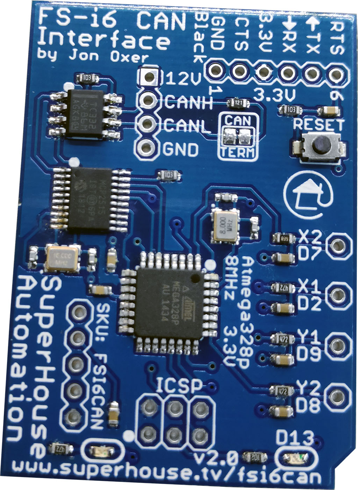

Flysky FS-i6 CAN Interface
==========================

Mounts inside a Flysky FS-i6 remote control transmitter to provide a
CAN bus interface for external control, so it can send and receive
commands from external input devices. This replaces the control normally
done using the built-in joysticks.

Intended for use with the Chair Breakout Mini, which interfaces with
assistive input devices including wheelchair joysticks and button
boxes and gives them a CAN bus interface.

This allows the wheelchair controls to be used to fly a drone or R/C
plane, or drive an R/C car.

Features:

 * Takes power from transmitter header.
 * CAN bus.
 * ATmega328 MCU (Arduino compatible)

More information is available at:

  https://www.superhouse.tv/fsi6can

Hardware
--------
The "Hardware" directory contains the PCB design as an EAGLE project.
EAGLE PCB design software is available from Autodesk free for
non-commercial use.

Firmware
--------
The "Firmware" directory contains example firmware as an Arduino
project.

Credits
-------
Jonathan Oxer <jon@oxer.com.au>

License
-------
Copyright 2018-2020 SuperHouse Automation Pty Ltd  www.superhouse.tv  

The hardware portion of this project is licensed under the TAPR Open
Hardware License (www.tapr.org/OHL). The "license" folder within this
repository contains a copy of this license in plain text format.

The software portion of this project is licensed under the Simplified
BSD License. The "licence" folder within this project contains a
copy of this license in plain text format.
